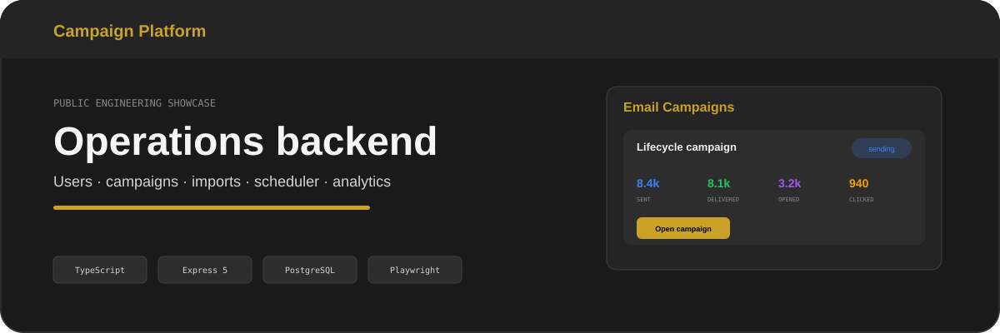
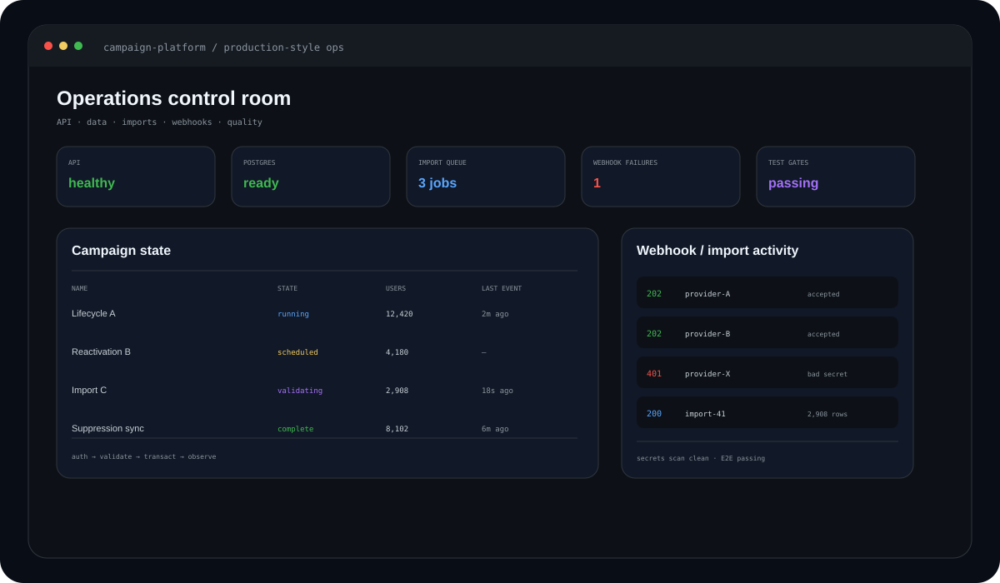
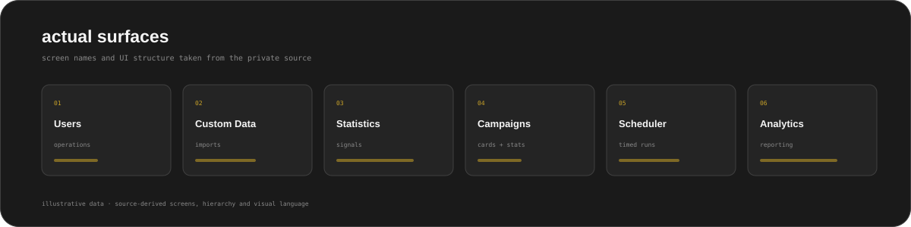
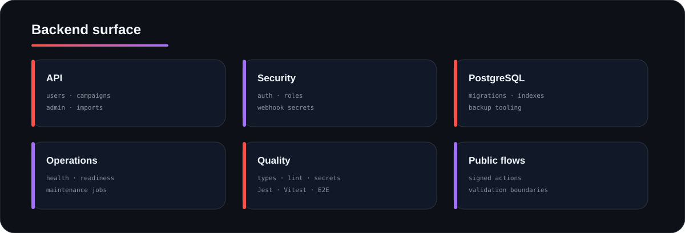
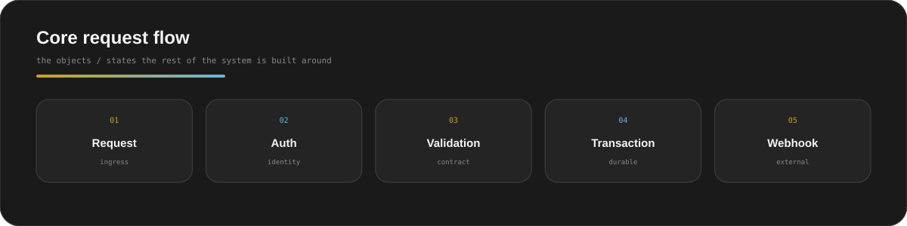
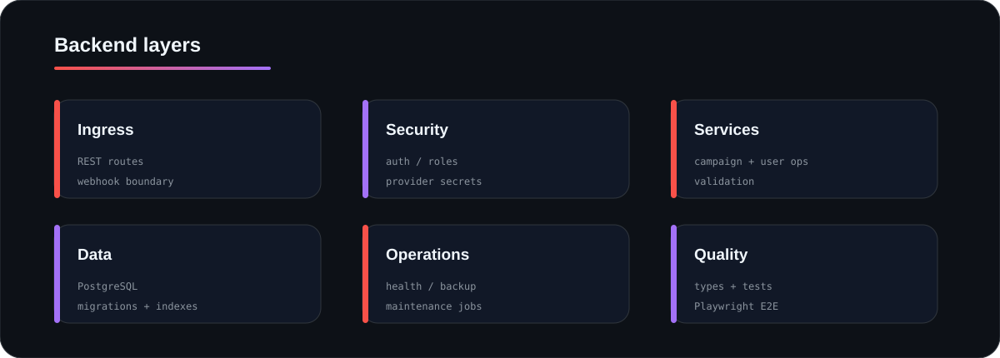
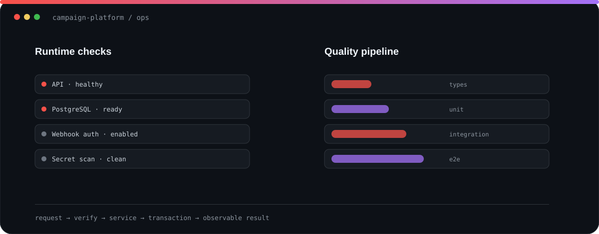
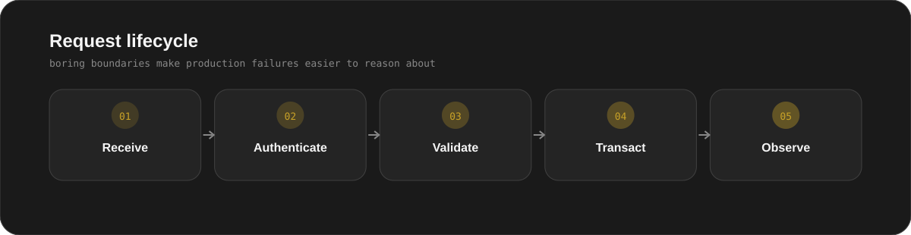
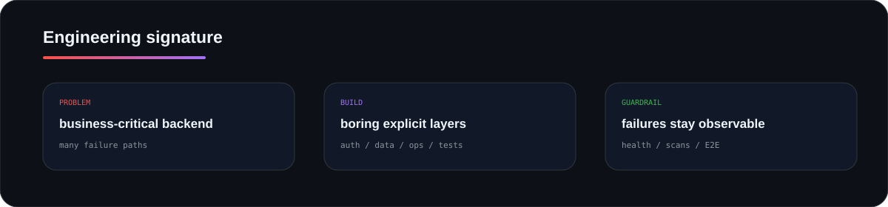

  
  
  
  
  

# Campaign Platform

A backend-heavy operations platform I built around **users, campaigns, imports, validation, webhooks and production tooling**.

The commercial domain is abstracted; the backend engineering is the point.

Illustrative records; screen hierarchy, labels and visual system are reconstructed from the private source.

## <code>01 / actual_surfaces</code>

## <code>02 / backend_surface</code>

## <code>03 / core_model</code>

## <code>04 / layers</code>

## <code>05 / request_lifecycle</code>

## <code>06 / built_for_failure</code>

| Failure | Guard |
|---|---|
| forged callback | provider-secret verification |
| admin exposure | auth + role middleware |
| sensitive logs | structured redaction |
| alive process / broken dependency | separate liveness and readiness |
| secret leak | CI secret scan |
| schema drift | explicit migrations + verification |
| UI regression | Playwright E2E |

The theme is intentionally boring: **explicit boundary, explicit state, explicit failure**.

## <code>07 / engineering_signature</code>

  

## <code>08 / inspect</code>

- [Architecture](docs/ARCHITECTURE.md)
- [Security model](docs/SECURITY.md)
- [Sanitised webhook boundary](examples/provider-webhook.ts)

<b>Why it is anonymised</b>

The private implementation contains domain-specific operations and production configuration that do not need to be public to demonstrate the engineering.

