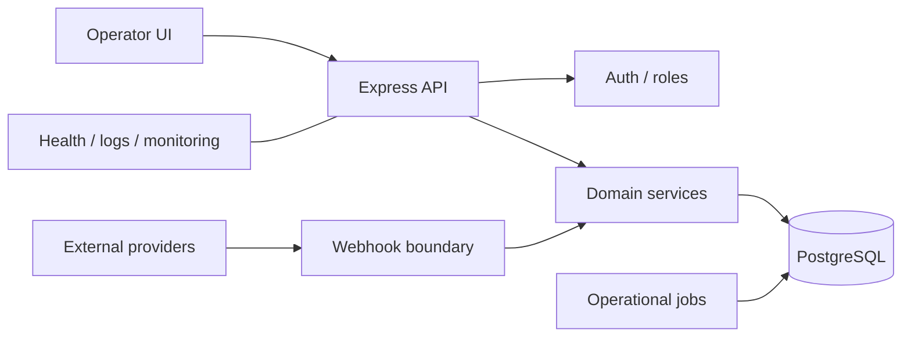
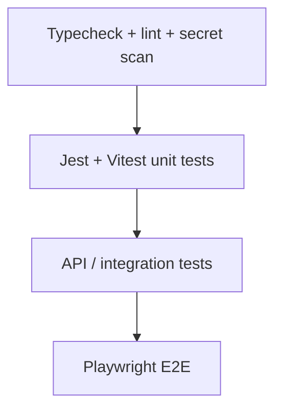

  

  
  
  
  
  

# Self-hosted Campaign & User Operations Platform

A backend-heavy platform for campaign operations, user data, imports, validation, webhooks and administrative workflows.

The private source originated in a commercial domain. This public version intentionally presents it as a generic engineering case study.

## Runtime shape

## Engineering highlights

- TypeScript + Express 5 application.
- PostgreSQL-backed primary data paths.
- Authenticated admin and user operations.
- Imports, validation and webhook endpoints.
- Signed public unsubscribe flow.
- Docker-first production runtime.
- Liveness and readiness endpoints.
- Secret scanning and environment leak checks.
- Jest / Vitest / Playwright quality layers.
- Database migration, backup, index verification and load-test tooling.

## Security defaults

- Administrative routes sit behind authentication + role checks.
- Webhooks require provider secrets.
- Sensitive request fields are redacted from structured logs.
- GraphQL is disabled in production unless explicitly enabled.
- Secrets are validated separately from application startup.

## Test pyramid

## Repository map

- [Architecture](docs/ARCHITECTURE.md)
- [Security model](docs/SECURITY.md)
- [Sanitised webhook example](examples/provider-webhook.ts)

## Source availability

Full implementation, operational configuration and domain-specific details remain private.
