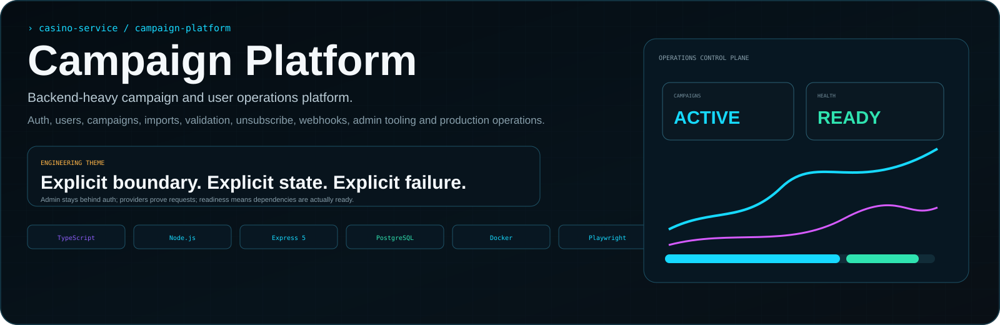
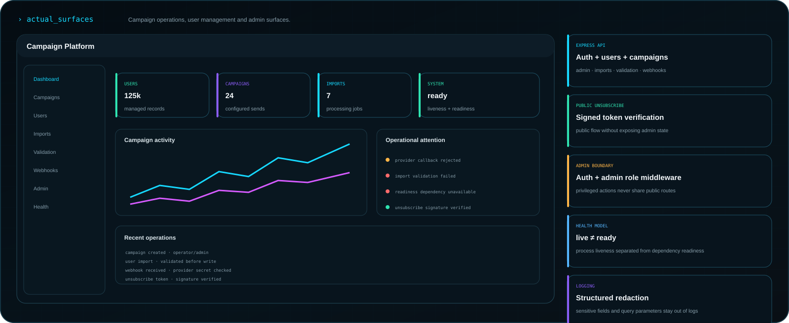
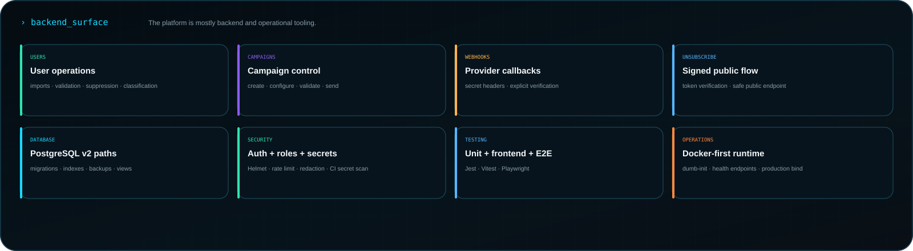
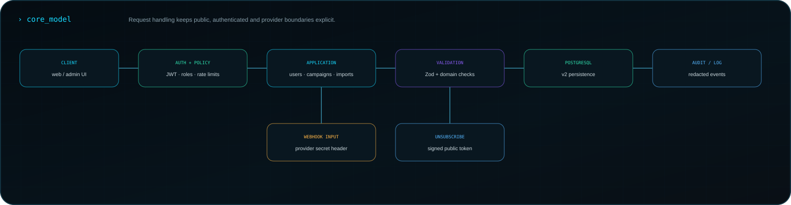
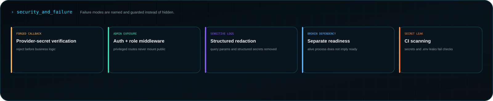
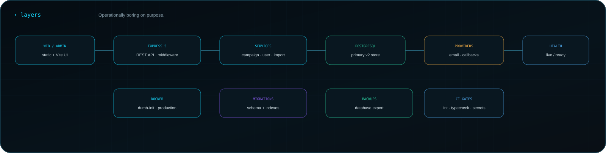
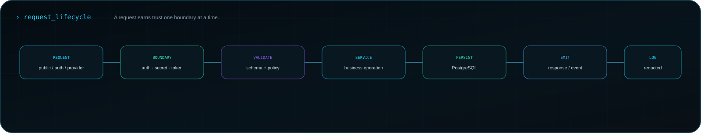
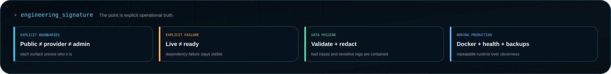

<table>
<tr>
<td width="50%" valign="top">

### What it is

A backend-heavy campaign operations platform built around explicit trust boundaries.

Main areas:

- users
- campaigns
- imports
- validation
- webhooks
- unsubscribe
- admin operations
- health / readiness
- production tooling

</td>
<td width="50%" valign="top">

### Engineering focus

- public ≠ authenticated ≠ provider ≠ admin
- provider-secret verification
- signed unsubscribe flow
- structured redaction
- separate liveness/readiness
- PostgreSQL persistence
- Docker-first production runtime
- CI security gates

</td>
</tr>
</table>

 

<table>
<tr>
<td width="52%" valign="top">

</td>
<td width="48%" valign="top">

### Boundary-first design

The platform does not let different request types enter through one generic trust path.

Admin actions, provider callbacks and public flows prove different things before the business layer sees them.

</td>
</tr>
</table>

 

<table>
<tr>
<td width="48%" valign="top">

### Failure semantics

A live process is not automatically a ready system.

Dependency failure, invalid provider input, admin exposure and sensitive logging all have explicit guards.

</td>
<td width="52%" valign="top">

</td>
</tr>
</table>

 

 

Private source · public engineering showcase
