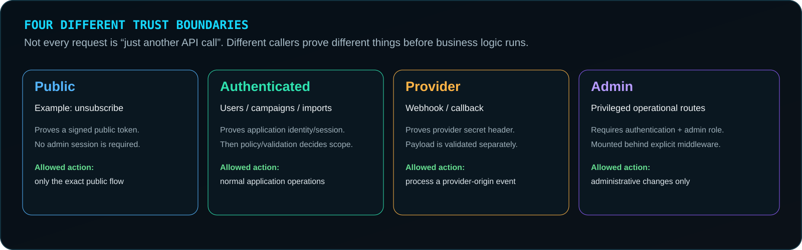
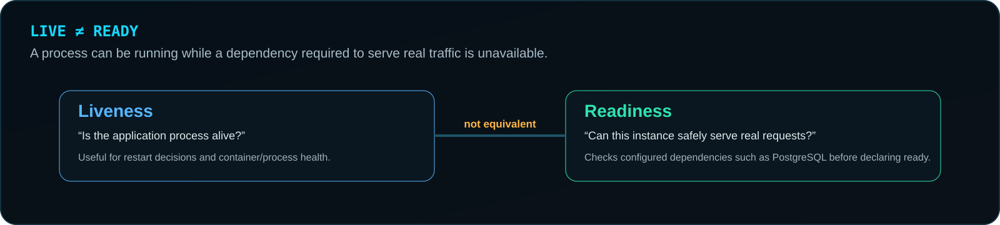

> **A backend-heavy campaign/user operations service with explicit trust boundaries.**  
> The interesting part is not a marketing dashboard — it is how public flows, authenticated operators, providers and admins are separated before business logic runs.

<table>
<tr>
<td align="center"><b>Express 5</b> API boundary</td>
<td align="center"><b>Node.js</b> runtime</td>
<td align="center"><b>PostgreSQL</b> v2 data paths</td>
<td align="center"><b>Docker</b> production runtime</td>
<td align="center"><b>Playwright</b> E2E coverage</td>
<td align="center"><b>Secret scanning</b> CI gate</td>
</tr>
</table>

## What the service actually does

<table>
<tr>
<td width="33%" valign="top"><b>Users</b> User operations, imports, validation and suppression/classification workflows.</td>
<td width="33%" valign="top"><b>Campaigns</b> Create/configure campaigns and drive the operational send lifecycle through explicit API routes.</td>
<td width="33%" valign="top"><b>External events</b> Provider webhooks/callbacks are accepted only after provider-secret verification and payload validation.</td>
</tr>
<tr>
<td valign="top"><b>Unsubscribe</b> A separate public flow verifies a signed token rather than reusing privileged application routes.</td>
<td valign="top"><b>Admin</b> Privileged routes sit behind authentication plus admin-role middleware.</td>
<td valign="top"><b>Operations</b> Health, readiness, logging, migrations, backups and Docker runtime are treated as part of the system contract.</td>
</tr>
</table>

## Trust model

> This is the core design choice: **public, authenticated, provider and admin requests do not get the same trust by default.**

## Health model

<table>
<tr>
<td width="50%" valign="top"><b>Liveness is intentionally shallow.</b> If the process is alive, an orchestrator does not need to restart it just because PostgreSQL is temporarily unavailable.</td>
<td width="50%" valign="top"><b>Readiness is dependency-aware.</b> An instance should not receive real traffic if a required dependency cannot satisfy the application contract.</td>
</tr>
</table>

## Security defaults

<table>
<tr>
<td width="33%" valign="top"><b>Provider callbacks</b> Require provider secret headers before processing.</td>
<td width="33%" valign="top"><b>Admin routes</b> Require auth + admin role middleware.</td>
<td width="33%" valign="top"><b>Logging</b> Redacts sensitive structured fields and sensitive query parameters.</td>
</tr>
<tr>
<td valign="top"><b>GraphQL</b> Disabled in production unless explicitly enabled.</td>
<td valign="top"><b>Secrets</b> CI includes secret scanning and environment-file leak checks.</td>
<td valign="top"><b>Input validation</b> Schema/domain validation happens before a request mutates state.</td>
</tr>
</table>

## Architecture

## Request lifecycle

<b>Runtime notes</b>

- Production bind is explicit: HOST=0.0.0.0.
- Docker uses dumb-init and runs the compiled server.
- PostgreSQL is required for the current v2 paths.
- Health endpoints separate live, ready and the general health view.
- The public showcase omits credentials, customer data and production-specific configuration.

