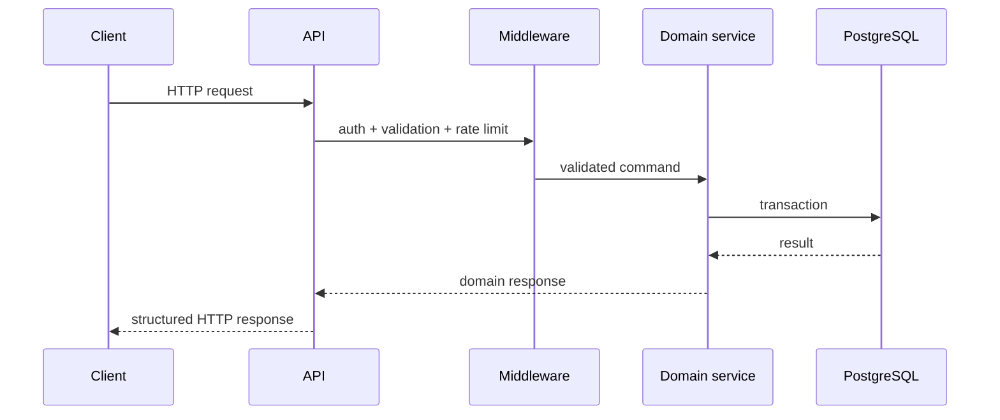

# Architecture

## Request lifecycle

## Operational layers

1. **Transport** — REST routes, public flows, webhook ingress.
2. **Security** — authentication, role checks, provider secrets, redaction.
3. **Domain services** — campaign/user operations and validation.
4. **Persistence** — PostgreSQL migrations, indexes and backups.
5. **Operations** — health, readiness, monitoring and maintenance commands.
6. **Quality** — static checks, unit tests, API tests and browser E2E.

The production repository also contains migration paths from earlier storage models; those details are intentionally omitted from the public showcase.
